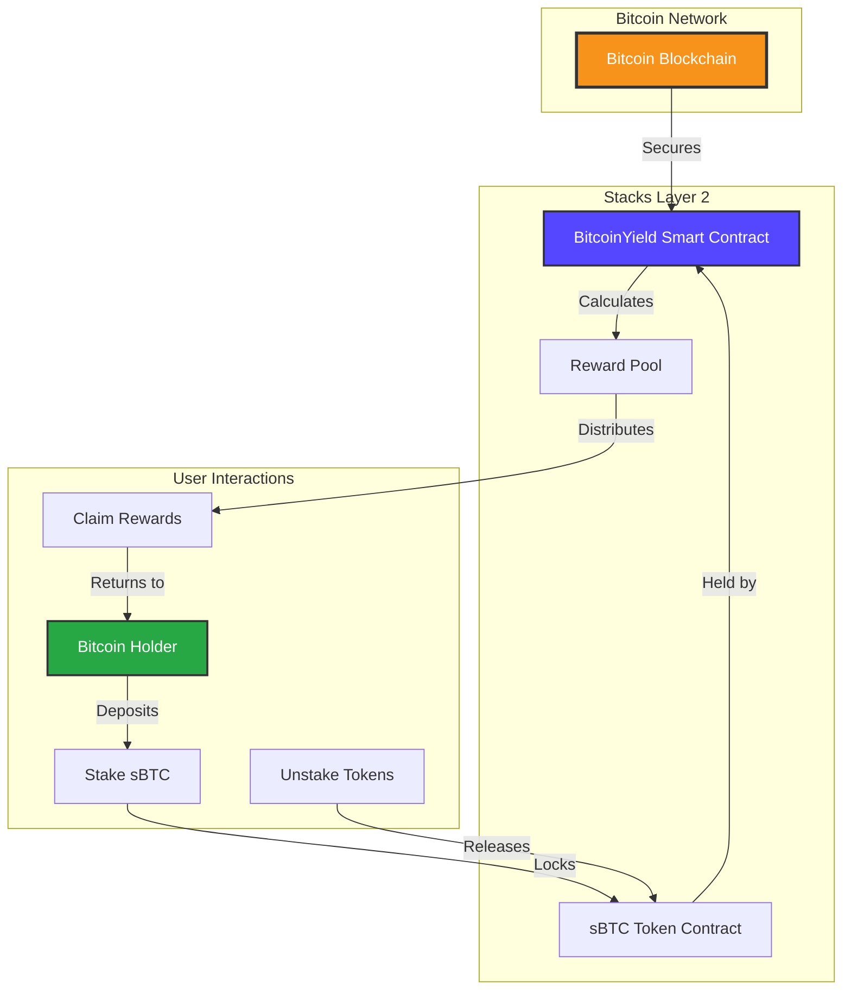

# BitcoinYield Protocol

> **Non-Custodial Bitcoin Staking Protocol on Stacks Layer 2**

[](https://stacks.co)
[](https://bitcoin.org)

## Overview

BitcoinYield is a revolutionary DeFi protocol that enables Bitcoin holders to earn passive income on their sBTC holdings without sacrificing self-custody. Built on Stacks Layer 2, it combines Bitcoin's unparalleled security with smart contract functionality to deliver trustless yield generation.

### Key Features

- 🔐 **Non-Custodial**: Users maintain full control of their Bitcoin assets
- ⏰ **Time-Weighted Rewards**: Earn more by staking longer
- 🛡️ **Bitcoin-Secured**: Inherits Bitcoin's security through Stacks Layer 2
- 💰 **Flexible Staking**: Configurable lock periods and reward rates
- 📊 **Transparent**: Real-time APY calculations and reward tracking
- ⚡ **Gas Efficient**: Optimized for Stacks network operations

## Architecture



## 📋 Protocol Mechanics

### Staking Process

1. **Deposit**: Users transfer sBTC to the protocol contract
2. **Lock**: Tokens are time-locked based on minimum staking period
3. **Earn**: Rewards accrue based on stake amount and duration
4. **Compound**: Users can claim rewards or compound them back into their stake

### Reward Calculation

```text
Reward = (Stake Amount × Reward Rate × Time Factor) / 10000
Time Factor = (Stake Duration × 10000) / Blocks Per Year
```

### Protocol Parameters

- **Minimum Stake Period**: ~10 days (1440 blocks)
- **Default Reward Rate**: 0.5% (5 basis points)
- **Blocks Per Year**: 52,560 (Stacks network)

## 🛠️ Installation & Setup

### Prerequisites

- [Clarinet](https://github.com/hirosystems/clarinet) CLI tool
- [Node.js](https://nodejs.org/) v16 or higher
- [Stacks Wallet](https://wallet.hiro.so/) for testing

### Local Development

```bash
# Clone the repository
git clone https://github.com/emediong-godwin/bitcoin-yield.git
cd bitcoin-yield

# Install Clarinet
curl -L https://github.com/hirosystems/clarinet/releases/latest/download/clarinet-linux-x64.tar.gz | tar xz
sudo mv clarinet /usr/local/bin

# Initialize project
clarinet new bitcoinyield
cd bitcoinyield

# Add the contract
cp ../bitcoinyield.clar contracts/

# Run tests
clarinet test

# Start local devnet
clarinet console
```

### Deployment

```bash
# Deploy to testnet
clarinet deploy --testnet

# Deploy to mainnet (production)
clarinet deploy --mainnet
```

## 📚 API Reference

### Public Functions

#### `stake(amount: uint)`

Stakes sBTC tokens to earn rewards.

- **Parameters**: `amount` - Amount of sBTC to stake (in satoshis)
- **Returns**: `(ok true)` on success
- **Errors**: `ERR_ZERO_STAKE` if amount is 0

#### `unstake(amount: uint)`

Unstakes tokens and claims pending rewards.

- **Parameters**: `amount` - Amount of sBTC to unstake
- **Returns**: `(ok true)` on success
- **Errors**: `ERR_TOO_EARLY_TO_UNSTAKE`, `ERR_NO_STAKE_FOUND`

#### `claim-rewards()`

Claims pending rewards without unstaking.

- **Returns**: `(ok true)` on success
- **Errors**: `ERR_NOT_ENOUGH_REWARDS`, `ERR_NO_STAKE_FOUND`

### Read-Only Functions

#### `get-stake-info(staker: principal)`

Returns stake information for a user.

```lisp
{
  amount: uint,      ;; Staked amount
  staked-at: uint,   ;; Block height when staked
}
```

#### `calculate-rewards(staker: principal)`

Calculates pending rewards for a staker.

- **Returns**: `uint` - Pending reward amount

#### `get-current-apy()`

Returns current APY as a percentage.

- **Returns**: `uint` - APY in basis points

## 💼 Usage Examples

### Frontend Integration

```javascript
import { StacksNetwork, StacksTestnet } from '@stacks/network';
import { contractPrincipalCV, uintCV } from '@stacks/transactions';

// Stake 1000 sBTC (1000 * 100000000 satoshis)
const stakeAmount = 100000000000;

const txOptions = {
  contractAddress: 'ST1PQHQKV0RJXZFY1DGX8MNSNYVE3VGZJSRTPGZGM',
  contractName: 'bitcoinyield',
  functionName: 'stake',
  functionArgs: [uintCV(stakeAmount)],
  network: new StacksTestnet(),
};

const transaction = await makeContractCall(txOptions);
```

### CLI Usage

```bash
# Check stake info
clarinet console
>> (contract-call? .bitcoinyield get-stake-info 'ST1PQHQKV0RJXZFY1DGX8MNSNYVE3VGZJSRTPGZGM)

# Calculate pending rewards
>> (contract-call? .bitcoinyield calculate-rewards 'ST1PQHQKV0RJXZFY1DGX8MNSNYVE3VGZJSRTPGZGM)
```

## 🧪 Testing

### Unit Tests

```bash
# Run all tests
clarinet test

# Run specific test file
clarinet test tests/bitcoinyield_test.ts
```

### Test Coverage

- ✅ Staking functionality
- ✅ Reward calculations
- ✅ Unstaking with time locks
- ✅ Administrative functions
- ✅ Error handling
- ✅ Edge cases and security

## 🔒 Security Considerations

### Audit Status

- [ ] **Pending**: Third-party security audit
- [x] **Complete**: Automated security scans
- [x] **Complete**: Code review by core team

### Security Features

- **Time Locks**: Prevent premature unstaking
- **Owner Controls**: Administrative functions restricted to contract owner
- **Input Validation**: All user inputs validated and sanitized
- **Overflow Protection**: Safe arithmetic operations throughout

### Risk Factors

- **Smart Contract Risk**: Bugs in contract code could lead to fund loss
- **Stacks Network Risk**: Dependency on Stacks Layer 2 functionality
- **sBTC Peg Risk**: Reliance on sBTC maintaining its Bitcoin peg

## 📊 Economics

### Reward Distribution

- Rewards are distributed from a pre-funded reward pool
- Pool must be maintained by protocol administrators
- Sustainable APY depends on pool funding and total staked amount

### Tokenomics

- **No Native Token**: Protocol operates directly with sBTC
- **Fee Structure**: Currently fee-free for users
- **Governance**: Centralized initially, roadmap includes decentralization

## 🛣️ Roadmap

### Phase 1: Core Protocol (Current)

- [x] Basic staking and unstaking
- [x] Time-weighted rewards
- [x] Administrative controls
- [ ] Security audit

### Phase 2: Enhanced Features

- [ ] Multi-asset staking support
- [ ] Automated reward compounding
- [ ] Emergency pause functionality
- [ ] Governance token launch

### Phase 3: Decentralization

- [ ] DAO governance implementation
- [ ] Protocol fee distribution
- [ ] Community-driven parameter updates
- [ ] Cross-chain expansion

## 🤝 Contributing

We welcome contributions from the Bitcoin and Stacks communities!

### Development Process

1. Fork the repository
2. Create a feature branch (`git checkout -b feature/amazing-feature`)
3. Make your changes and add tests
4. Commit your changes (`git commit -m 'Add amazing feature'`)
5. Push to the branch (`git push origin feature/amazing-feature`)
6. Open a Pull Request

### Code Style

- Follow Clarity best practices
- Add comprehensive tests for new features
- Update documentation for API changes
- Ensure all tests pass before submitting

---

### Built with ❤️ for the Bitcoin community
